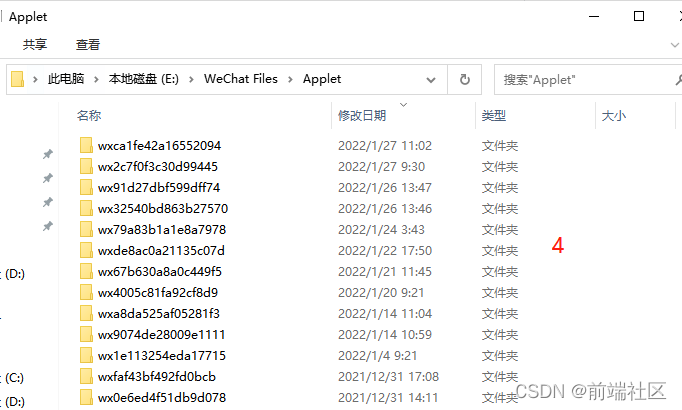

# PC获取微信小程序源码
## 环境准备
- node环境准备  
    [node下载地址](http://nodejs.cn/)

- 反编译工具  
    [反编译软件下载](./%E5%B0%8F%E7%A8%8B%E5%BA%8F%E5%8F%8D%E7%BC%96%E8%AF%91%E5%B7%A5%E5%85%B7.zip)
--------
## 具体操作
1.  ```
    在通过微信PC打开小程序前，我们最好先找到缓存到本地的小程序包路径，一般都是在 微信PC安装目录\WeChat Files\WeChat Files\Applet
    ```
    ### 查找微信小程序加密包：
      
      
    

    上图中每个文件夹代表一个小程序，一般最新打开的小程序都是在第一个，如果不确定可以排序一下修改日期
    ```
    找到路径了我们就可以用微信PC打开小程序了，打开后就会发现当前目录新增了一个文件夹，里面存放的就是加密后的小程序包
    ```
    

2.  ## 解密包
    刚获取到的包我们还不能进行反编译，必须要通过**解密软件**修改一下才能反编译
      
    ### 本篇就演示一个主包和一个分包反编译的过程就可以了，先通过解密软件修改一下主包
      

    ### 解密的主包自动到 wxpack 这个包里面来了，同样的步骤解密一个分包，下图是我解密好的两个，并且修改了一下名称，好区分

      

3.  ## 最后一步：**反编译**
    ### 进入 wxpack 的同级目录 wxappUnpacker-master，在路径栏输入 cmd 自动打开当前目录的 命令窗口了

      

    ### 先反编译一下主包，输入一下命令：
    ```
    node wuWxapkg.js ..\wxpack\master-app.wxapkg
    ```

    ```
    master-app.wxapkg是wxpack目录下解密的包
    ```
      

    ### **再反编译分包，把反编译后的文件夹放到 wxpack 同级目录中**

    ```
    node wuWxapkg.js -s=..\ ..\wxpack\_pages_app.wxapkg
    ```

- -s 表示分包
- 第一个…\ 表示输出位置
- …\wxpack_pages_app.wxapkg 需要反编译的分包位置

      
